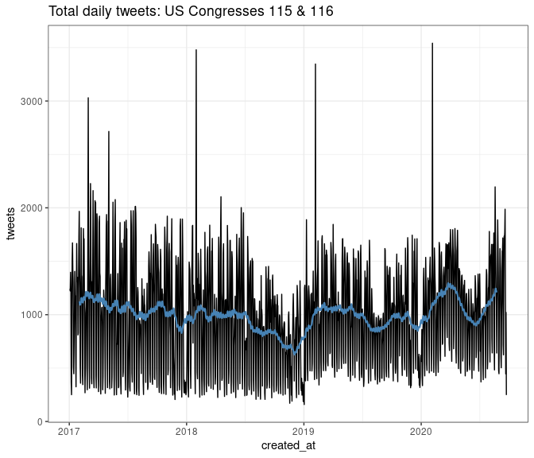

Corpus composition
------------------

Collecting all tweets generated by all lawmakers from congresses 115 &
116 (3 January 2017 to present day) in one fell swoop is not possible
via the Twitter API. Instead, the best way to build such a corpus would
have been to scrape tweets daily or weekly for congress members starting
at 3 January 2017.

While this ship has sailed for me (at least for the 115th and most of
the 116th), other/smarter folks have been doing this – eg – [the George
Washington University (GWU)
Library](https://tweetsets.library.gwu.edu/). GWU makes available Tweet
IDs for this set of tweets, and [DocNow’s
Hydrator](https://github.com/DocNow/hydrator), eg, can be used to obtain
actual tweet data based on the Tweet ID.

I then keep the (116th portion of the) corpus up-to-date using the R
package `rtweet`, collecting status updates for Twitter handles used to
build the GWU tweet collection. Via an automated daily script that can
be used in subsequent congresses. From this perspective, then, we only
use the GWU tweet sets to get caught up on the congressional tweet
collection.

### Descriptives

Some important trends. Some (potential) explanations:

1.  Average length of tweets (in words) increased substantially from
    2017 to 2018; presumably a result of Twitter’s increased character
    limit from 140 to 280 at the end of 2017.

2.  Total number of Twitter lawmaker accounts roughly doubled from the
    115th congress to the 116th. Without any real effects on the number
    of total tweets from 115 to 116. The folks at GWU included
    “auxiliary” accounts for members in the 116th Twitter scrape, eg,
    both “office” & “campaign” accounts.

It is not clear if this is per some methodological change on the part of
GWU, or a result of more lawmakers in 116 using more than one account.

``` r
korpus <- load_lawmaker_tweets()

xsum1 <- korpus %>%
  mutate(tokens = tokenizers::count_words(text),
         yr = gsub('-.*', '', created_at))

xsum2 <- xsum1 %>%
  group_by(congress, yr) %>%
  summarise(tweets = n(),
            tokens = sum(tokens),
            ers = length(unique(toupper(screen_name))),
            ave = round(tokens/tweets, 1)) %>%
  mutate(tweets = formatC(tweets, big.mark = ','),
         tokens = formatC(tokens, big.mark = ','))
```

    ## `summarise()` regrouping output by 'congress' (override with `.groups` argument)

``` r
xsum2 %>% knitr::kable()
```

|  congress| yr   | tweets  | tokens     |  ers|   ave|
|---------:|:-----|:--------|:-----------|----:|-----:|
|       115| 2017 | 382,281 | 8,101,282  |  513|  21.2|
|       115| 2018 | 326,864 | 10,606,772 |  510|  32.5|
|       115| 2019 | 507     | 13,610     |  267|  26.8|
|       116| 2019 | 354,711 | 12,367,502 |  894|  34.9|
|       116| 2020 | 291,763 | 10,333,505 |  903|  35.4|

``` r
xsum1 %>%
  group_by(congress, yr, created_at) %>%
  summarise(tweets = n(),
            tokens = sum(tokens),
            ers = length(unique(screen_name))) %>%
  ungroup() %>%
  mutate(moving_n = zoo::rollmean(tweets, 
                                  k = 60, 
                                  fill = NA)) %>%
  ggplot() +
  geom_line(aes(x = created_at, 
                y = tweets)) +
  
    geom_line(aes(x = created_at,
                y = moving_n),
            color = 'steelblue',
            #linetype = 2,
            size = 0.75) +
  theme_bw() +
  ggtitle('Daily tweets: US Congresses 115 & 116')
```


