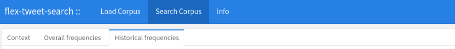
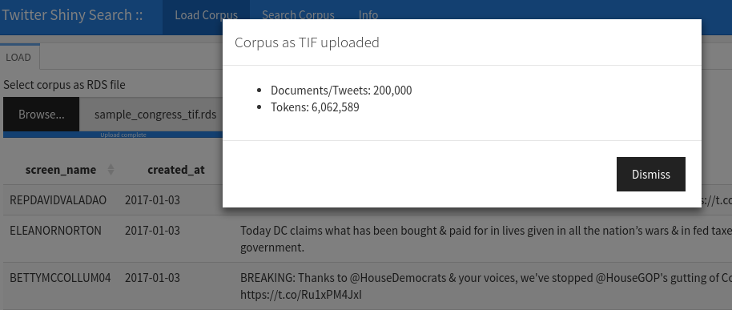
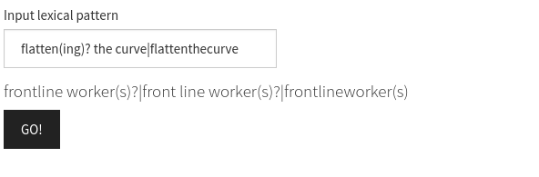
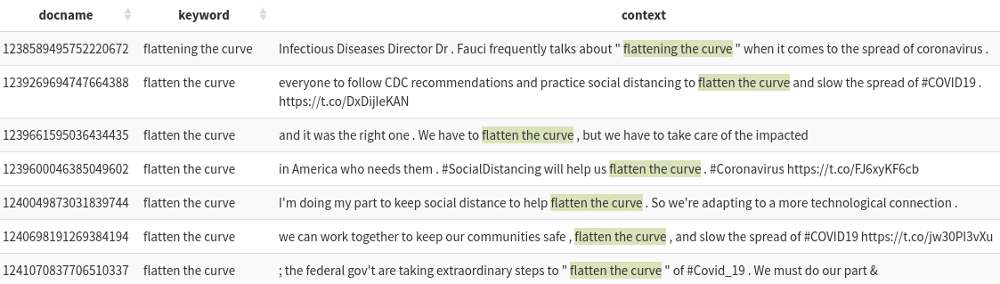
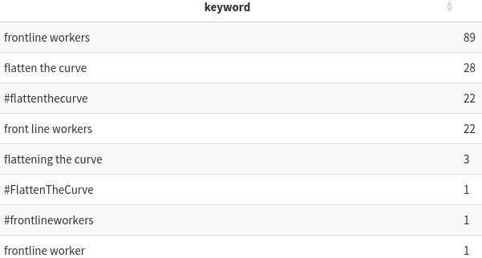
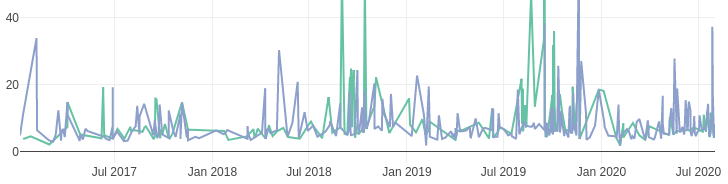

Twitter corpus search
=====================

A
[shiny/flexdashboard](https://github.com/jaytimm/twitter-and-us-lawmakers/blob/master/app/flexdash-tweet-search.Rmd)
for searching a Twitter corpus for lexical patterns in context. A quick
& simple exploration tool.

------------------------------------------------------------------------

### (1) Load a corpus of tweets, ie, output from the `rtweet` package

### (2) Search for complex lexical patterns

### (3) Explore search results in context

### (4) Get simple frequency counts of search terms

### (5) Investigate historical patterns

